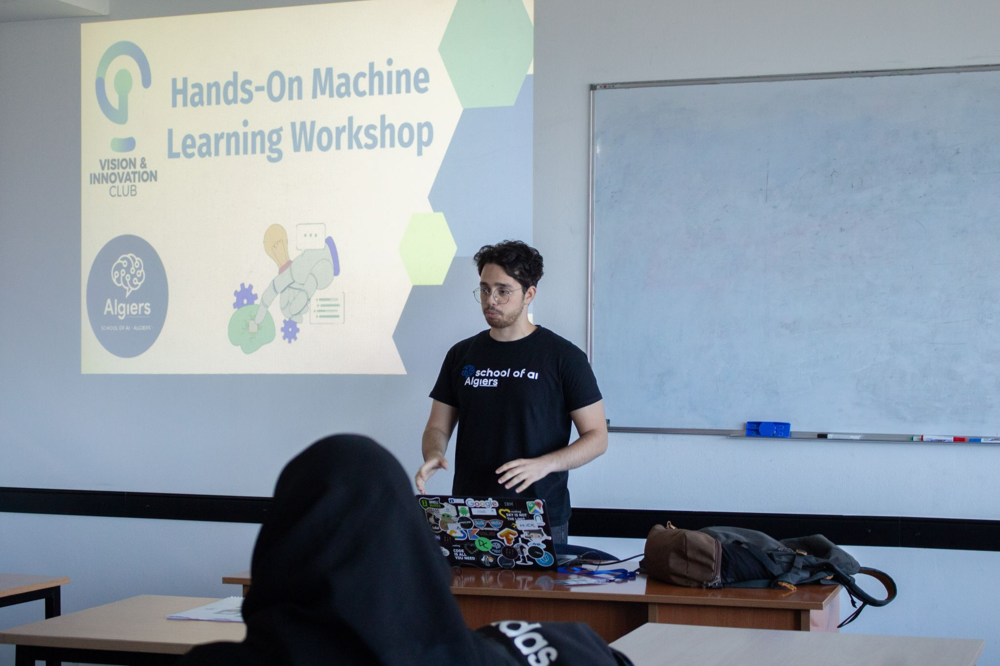
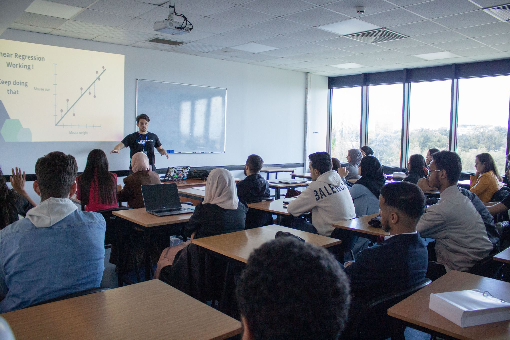
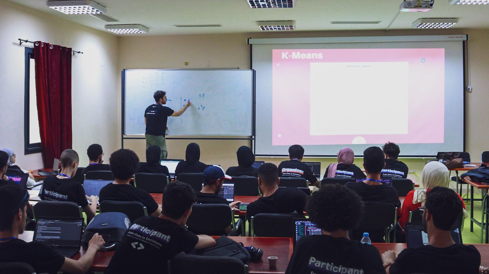
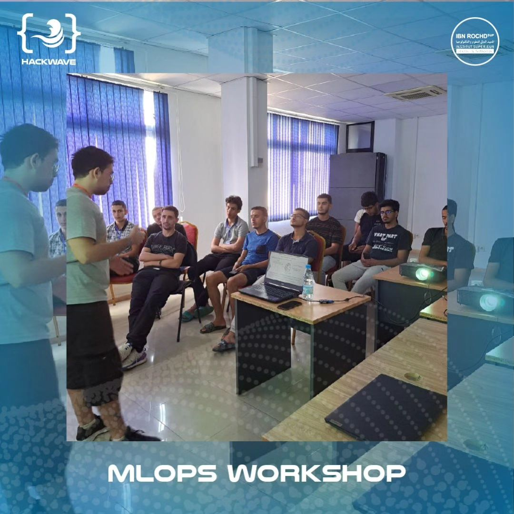
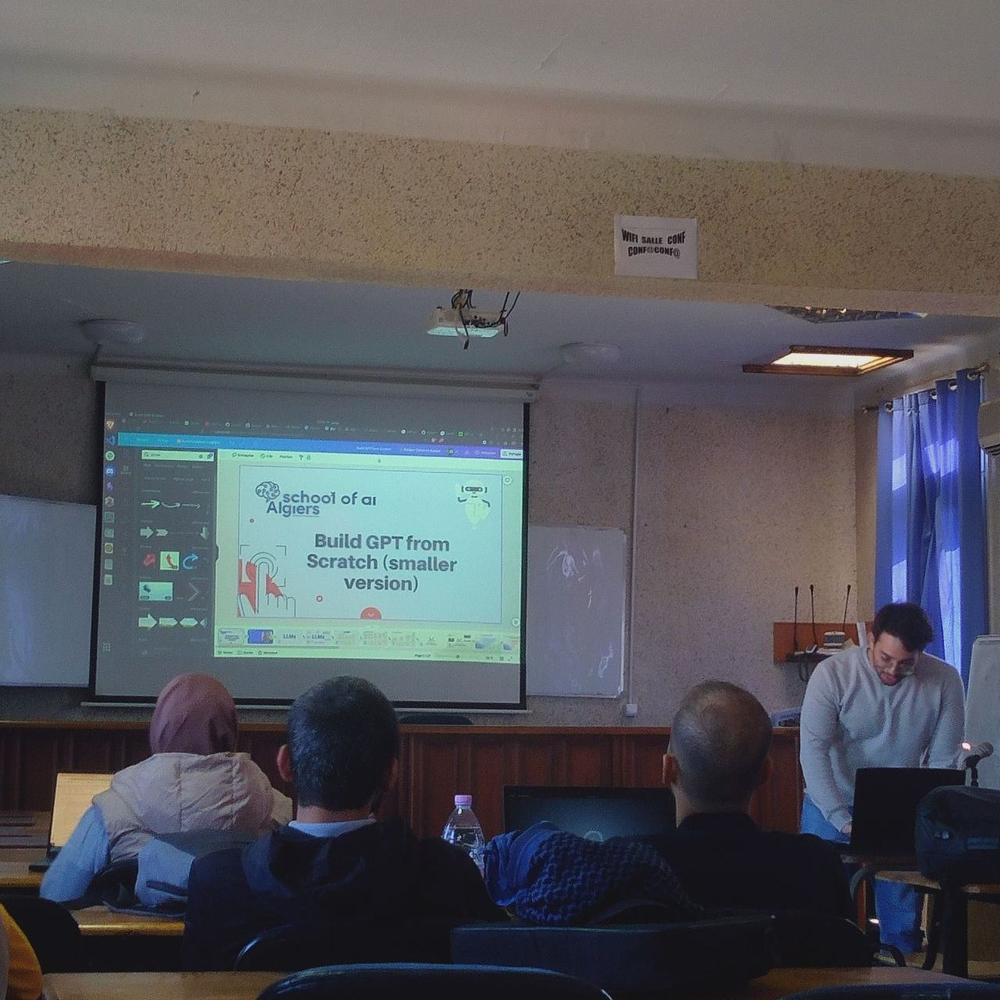

# Workshops Repository

Welcome to the repository where I save content and slides of the workshops I've conducted so far. Explore the content and dive deeper into each topic presented, please contact me for any error you have spotted, amelioration you want to see and topics you want to discuss.

## Contents
1. [Hands-On Machine Learning](#hands-on-machine-learning)
2. [Beyond Labels: Unsupervised Learning](#beyond-labels-unsupervised-learning)
3. [The Next step after ML: MLOps](#the-next-step-after-ml-mlops)

---

### Hands-On Machine Learning

Held at ENSAA (Ecole Nationale Algérienne des Affaires) as part of the Techup Event organized by VIC ENP Club. This workshop covered:
- Core concepts of Machine Learning
- Types of Machine Learning
- Principles of Linear Regression and KMeans
- Key concepts: Bias, Invariance, Overfitting, and Underfitting
- Challenges of unclean data and solutions

[Go to Hands-On Machine Learning Folder](./Introduction%20to%20Machine%20Learning%20Workshop)

---

### Beyond Labels: Unsupervised Learning

Presented at the AI Fest by the GDSC ENSIA Club. This workshop emphasized:
- In-depth exploration of Unsupervised Learning techniques
- Real-world applications and case studies
- Engaging Q&A sessions with participants

[Go to Beyond Labels: Unsupervised Learning Folder](./Unsupervised%20Learning%20Workshop)

---

### The Next Step after ML: MLOps

Organized by the IT Community Club, this workshop delved into:
- The three levels of MLOps
- Model deployment techniques
- Containerization practices
- Monitoring using Prometheus and Grafana
- CI/CD workflows with GitHub actions

[Go to The Next Step after ML: MLOps](./MLOps%20Workshop)

---

### Building GPT from scratch (a smaller version)

Organized by my club School of AI Algiers and in collaboration with Mr. Abdelghani Kabor, this workshop delved into:
- What are LLMs ? How are they used today ? How companies will embrace them ? What are the problems of LLMs ?
- The "not yet" perspective of LLMs and the need of scaling to emmerge new tasks for neural networks to perform.
- What is GPT exactly and why is it so powerful ?
- A small dive into the Transformer architecture and its components.
- Building a small GPT version that performs text generation character by character. (Inspired by [this video](https://youtu.be/kCc8FmEb1nY?si=psXPE9kV3f-VyffC)

[Go to Building GPT from scratch](./Build-gpt-from-scratch)

