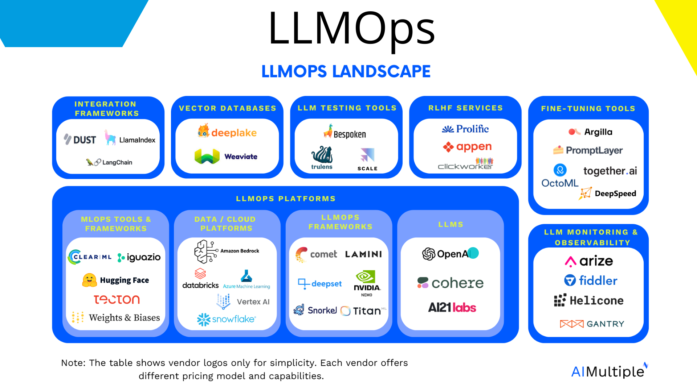
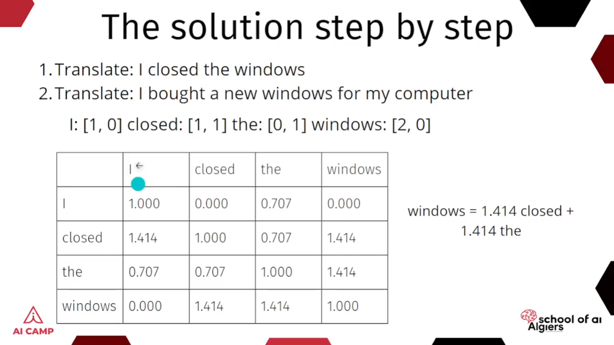

# Workshops Repository

Welcome to the repository where I save content and slides of the workshops I've conducted so far. Explore the content and dive deeper into each topic presented, please contact me for any error you have spotted, amelioration you want to see and topics you want to discuss.

## Contents
1. [Hands-On Machine Learning](#hands-on-machine-learning)
2. [Beyond Labels: Unsupervised Learning](#beyond-labels-unsupervised-learning)
3. [The Next step after ML: MLOps](#the-next-step-after-ml-mlops)

---

### Hands-On Machine Learning

Held at ENSAA (Ecole Nationale Algérienne des Affaires) as part of the Techup Event organized by VIC ENP Club. This workshop covered:
- Core concepts of Machine Learning
- Types of Machine Learning
- Principles of Linear Regression and KMeans
- Key concepts: Bias, Invariance, Overfitting, and Underfitting
- Challenges of unclean data and solutions

[Go to Hands-On Machine Learning Folder](./Introduction%20to%20Machine%20Learning%20Workshop)

---

### Beyond Labels: Unsupervised Learning

Presented at the AI Fest by the GDSC ENSIA Club. This workshop emphasized:
- In-depth exploration of Unsupervised Learning techniques
- Real-world applications and case studies
- Engaging Q&A sessions with participants

[Go to Beyond Labels: Unsupervised Learning Folder](./Unsupervised%20Learning%20Workshop)

---

### The Next Step after ML: MLOps

Organized by the IT Community Club, this workshop delved into:
- The three levels of MLOps
- Model deployment techniques
- Containerization practices
- Monitoring using Prometheus and Grafana
- CI/CD workflows with GitHub actions

[Go to The Next Step after ML: MLOps](./MLOps%20Workshop)

---

### Building GPT from scratch (a smaller version)

Organized by my club School of AI Algiers and in collaboration with Mr. Abdelghani Kabot, this workshop delved into:
- What are LLMs ? How are they used today ? How companies will embrace them ? What are the problems of LLMs ?
- The "not yet" perspective of LLMs and the need of scaling to emmerge new tasks for neural networks to perform.
- What is GPT exactly and why is it so powerful ?
- A small dive into the Transformer architecture and its components.
- Building a small GPT version that performs text generation character by character. (Inspired by [this video](https://youtu.be/kCc8FmEb1nY?si=psXPE9kV3f-VyffC)

[Go to Building GPT from scratch](./Build-gpt-from-scratch)

---

### LLMs from an engineering POV

Organized online by CSE Algiers (Club Scientifique de l'ESI), I delved into:
- Fundamentals of Large language models
- 3 use cases of LLMs realized by big companies (google, nvidia and amazon)
- Chains, agents and tools
- LLM-based apps design patterns
- LLMOps

[Go to LLMs from an engineering POV](./LLMs-engineer-POV)

---

### Attention mechanism and Transformers architecture (in Darija)

Organized by my club School of AI, in this video I explored:

- The limitations of LSTMs in capturing long sequences and the need for attention mechanisms.
- An introduction to word embeddings and their role in representing word meanings as vectors.
- How the attention mechanism works and why it provides better context management.
- The step-by-step solution involving embeddings, encoder-decoder architecture, and transformers.
- A dive into the Transformer architecture, highlighting the benefits of parallel processing for sequence tasks.

[Go to Attention mechanism and Transformers architecture (in darija)](./Attention-mechanism-transformers-darija)

---

### Efficiently using LLMs and securing them with Guardrails

Organized by my club School of AI during AI Summit 2025 and the video is on youtube on this [link](https://www.youtube.com/live/GU-vhQFXEVM?si=2f1aLZGSbOu15Xo7)
- The importance of efficiency and security when using large language models in applications.
- Techniques to use LLMs effectively, including avoiding costly calls and applying efficient methods like TF-IDF.
- Introduction to guardrails for securing LLMs, with examples of validating inputs and outputs to prevent manipulation.
- Recommendations for choosing the right LLM based on benchmarks, private data needs, and whether fine-tuning or agentic workflows are required.

